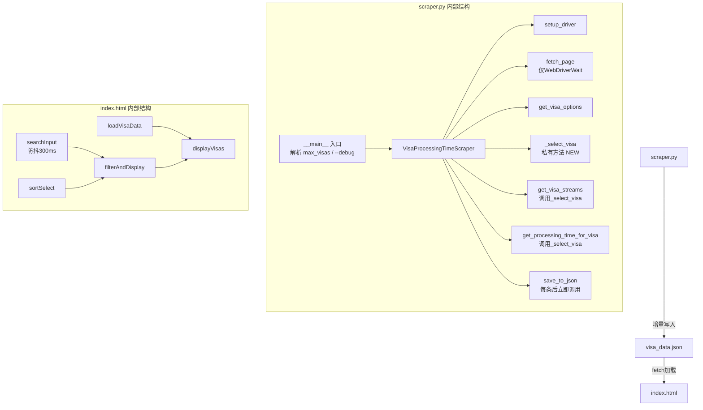

## 用户需求

对现有澳大利亚签证处理时间爬虫项目进行全面代码优化，提升性能、健壮性和工程规范。

## 产品概述

一个两部分组成的工具：`scraper.py` 负责从澳大利亚移民局官网爬取签证处理时间数据并保存为 JSON；`index.html` 负责读取 JSON 并以卡片形式可视化展示，支持搜索筛选。

## 核心优化点

### scraper.py

- **消除 `time.sleep` 盲等**：将所有 `sleep` 替换为 `WebDriverWait` 显式等待，减少无效等候时间
- **消除重复逻辑**：将 `get_visa_streams()` 和 `get_processing_time_for_visa()` 中重复的"选择签证类型"JS代码抽取为私有方法 `_select_visa()`
- **修复宽泛异常捕获**：将第 118 行裸 `except:` 改为 `except Exception as e` 并记录日志
- **增量写入 JSON**：每爬完一条立即追加写入，防止中途崩溃丢失全部数据
- **调试文件按需生成**：新增 `--debug` 命令行参数控制是否输出 `debug_visa_*.html`，默认关闭
- **添加 `.gitignore`**：将 `visa_data.json`、`debug_*.html` 等运行产物排除出版本控制

### index.html

- **展示 `status` 和 `submitted_info` 字段**：JSON 中已有但界面未使用的两个字段补充到卡片中
- **搜索防抖**：对搜索输入添加 300ms 防抖，避免每次按键都触发过滤
- **排序功能**：新增按 50% 处理时间排序的下拉选项
- **优化错误提示**：数据加载失败时提供更清晰的操作指引

## 技术栈

与现有项目保持一致，无新增依赖：

- **Python 3 + Selenium + BeautifulSoup4**：爬虫核心，沿用现有 `requirements.txt`
- **原生 HTML/CSS/JS**：前端可视化，无框架依赖

---

## 实现方案

### scraper.py 优化策略

#### 1. 消除 `time.sleep` — 用 `WebDriverWait` 替换

核心思路：用显式条件等待代替固定时间盲等，条件满足即继续，超时则抛出可捕获异常。

| 位置 | 原代码 | 优化后 |
| --- | --- | --- |
| `fetch_page()` 第 48 行 | `sleep(3)` + `WebDriverWait` 双重等待 | 删除 `sleep(3)`，仅保留 `WebDriverWait` |
| `get_visa_streams()` 第 100 行 | `sleep(2)` 等待下拉出现 | `WebDriverWait(...).until(EC.presence_of_element_located((By.ID, "visastream")))` 加 `NoSuchElementException` 回退 |
| `get_processing_time_for_visa()` 第 142 行 | `sleep(2)` 等待签证类型选中响应 | 等待 `visastream` 或结果区出现 |
| 第 155 行 | `sleep(2)` 等待 stream 选中响应 | `WebDriverWait` 等待日期输入框可交互 |
| 第 162 行 | `sleep(1)` 等待日期输入 | 直接移除（JS赋值无需等待） |
| 第 172/176 行 | `sleep(3)` 等待结果 | `WebDriverWait` 等待 `#main-info-container` 出现 |
| 第 183 行 | 冗余 `sleep(2)` | 删除 |
| `run()` 第 328/338 行 | `sleep(2)` 等待页面重新加载 | `WebDriverWait` 等待 `#visatype` 重新出现 |


预期效果：全程等待时间从每签证约 8-10 秒降至 2-4 秒（取决于网速）。

#### 2. 抽取 `_select_visa()` 私有方法

```
_select_visa(visa_value)
  -> 执行JS设置 #visatype.value
  -> 触发 change 事件
  -> WebDriverWait 等待页面响应
```

`get_visa_streams()` 和 `get_processing_time_for_visa()` 均调用此方法，消除重复。

#### 3. 增量写入

`run()` 中每次 `all_visa_data.append(visa_data)` 后立即调用 `save_to_json(all_visa_data)`，而不是全部完成后再写。由于是全量覆盖写入，文件始终保持完整合法的 JSON，中途中断也不会产生损坏文件。

#### 4. `--debug` flag

在 `__main__` 入口新增参数解析：

```
python scraper.py all          # 正常运行，不输出调试文件
python scraper.py all --debug  # 输出 debug_visa_*.html
```

`debug` 标志透传给 `VisaProcessingTimeScraper(debug=False)`，在 `get_processing_time_for_visa()` 中控制是否写文件。

#### 5. 异常修复

```python
# 第118行：原来
except:
    return []

# 修复后
except Exception as e:
    print(f"  未找到visastream下拉框（该签证无子类别）: {e}")
    return []
```

---

### index.html 优化策略

#### 1. 展示 `status` 和 `submitted_info`

在每张签证卡片底部新增状态区域，用图标+颜色区分 "Within standard" / 其他状态。

#### 2. 搜索防抖

```js
let debounceTimer = null;
searchInput.addEventListener('input', (e) => {
    clearTimeout(debounceTimer);
    debounceTimer = setTimeout(() => { filterAndDisplay(e.target.value); }, 300);
});
```

#### 3. 排序功能

在搜索框旁新增 `<select>` 排序下拉：

- 默认（原始顺序）
- 按 50% 时间升序
- 按 90% 时间升序

排序时从处理时间字符串中提取数字和单位（Days/Months）进行归一化比较（1 Month = 30 Days）。

#### 4. 错误提示改进

加载失败时提示具体原因（文件不存在 vs 解析失败），并显示"运行 `python scraper.py` 生成数据"的操作指引。

---

## 架构设计



---

## 目录结构

```
visa/
├── scraper.py          # [MODIFY] 核心优化：消除sleep、抽取_select_visa、增量写入、--debug flag、修复异常
├── index.html          # [MODIFY] 展示status/submitted_info、搜索防抖、排序功能、错误提示优化
├── .gitignore          # [NEW] 排除 visa_data.json、debug_*.html、__pycache__、*.pyc
├── requirements.txt    # [不变] 依赖无变化
└── README.md           # [MODIFY] 更新 --debug 参数说明
```